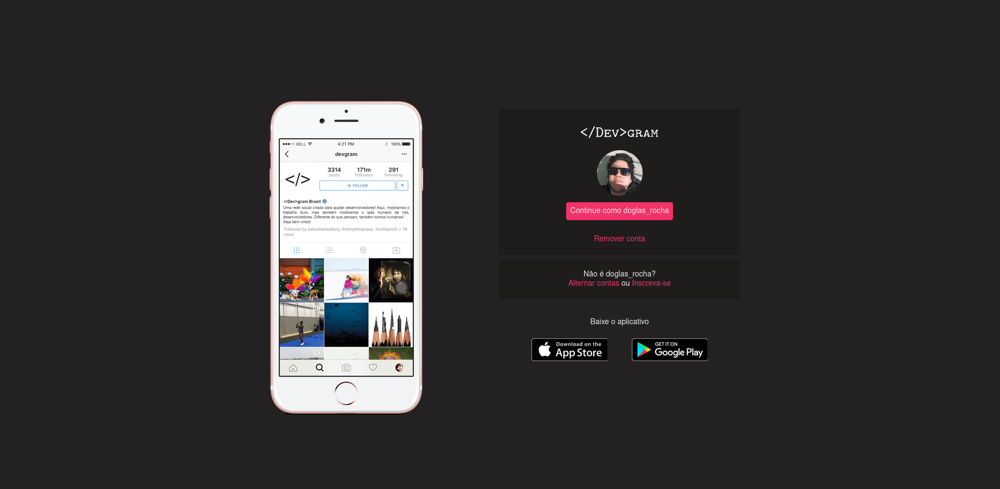

# \</Dev>gram 

* Projeto criado no curso "Recriando a página inicial do Instagram" do Bootcamp HTML Web Developer da Digital Innovation.

* Nele, alguns conceitos de CSS Flexbox e responsividade foram abordados.

* Decidi então, criar o \</Dev>gram, uma rede social para Devs!
* Você pode encontrar o \</Dev>gram <a href="https://doglasrocha.github.io/devgram/">aqui</a>!

* Imagem do \</Dev>gram:

